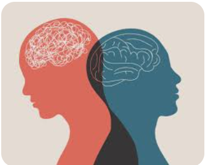
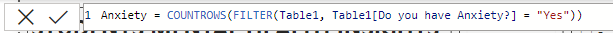
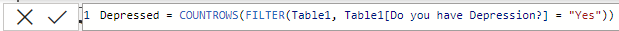
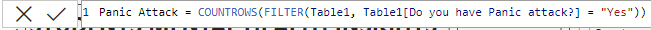
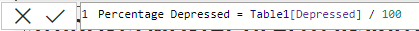
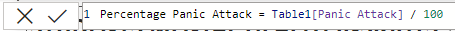
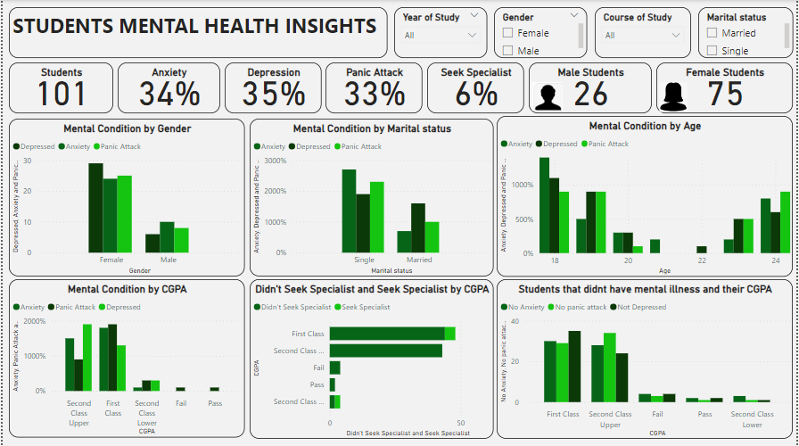
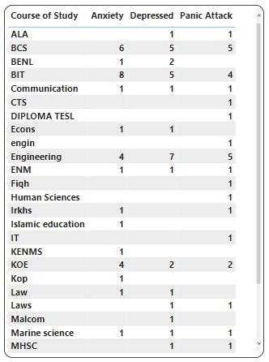

# Students Mental Health Insights

___

## Introduction:

This dataset was found in an online learning class, and my teammates and I worked on it. But I made the decision to take my time with it and work on honing my data cleaning, analysis, and visualisation skills using Power BI.

## Problem Statement:

- How many students are there in total?
- What proportion of the students experienced anxiety, panic attacks, or depression?
- What proportion of students seek the specialist for treatment?
- Was there a relationship between a student’s CGPA and their degree of mental health?
- Any further pertinent data-driven insights on students’ mental health?

## Skill Demonstrated:
- DAX

- Quick Measure

- Filter

## Data Sourcing:

The data was scrapped from the Kaggle. To clean, analyse, and visualise the data, I imported the CSV file that I had downloaded into Power Bi. There was just one sheet or table.

## Data Transformation/Cleaning:

With the help of Power BI’s power query editor, the dataset was effectively cleaned and transformed.

## Data Modelling: 

There was no requirement for data modelling because the dataset contained just one sheet or table.

## Analysis and Visualization

___

- According to the dashboard, there were 101 students in total, with 75 of them being female and 26 being male.
- The data shows that female students are more likely than male students to have mental illnesses like anxiety, panic attacks, and sadness.
- Single females experience more anxiety than their mates, and 18-year-old students suffer from mental illness more than any other age group.
- Another noteworthy finding is that year 1 students experience more mental distress than other students, which may be due to a change in environment and an inability to adapt to it.
- From the analysis, we can also infer that students without any mental challenges performed significantly well and had better grades when compared to the students managing anxiety, panic attack, and depression. 
- The course with the highest number of challenged students is BIT (Bachelor’s of Information Technology).

___

## Summary:

101 students in total, 75 female and 26 male, are shown by the dashboard statistics. Based on the analysis, more female students, particularly single females and under the age of 18, are mentally worried. Due to environmental changes, Year 1 students, especially those in BIT, encounter more mental challenges.

## Conclusion and Recommendation:

The university can take into account the following suggestions given that female students are more likely than male students to experience mental health issues: 

- Ensure safety and open communication with the student body and the female gender by providing efficient channels for suggestions and grievances, secure forums and community networks, and high representation in positions of leadership.. 
- The university should think about implementing orientation programmes that concentrate on assisting new students in adjusting to the university's environment and following up after the orientation, to see necessary lapses to fix. Year 1 students are facing greater mental challenges, particularly with the BIT programme. The institution can help students transition by offering mentorship opportunities, study skills classes, and mental health resources. Additionally, in the BIT programme, take into account providing additional academic assistance, establishing a feeling of community through group projects, and encouraging open lines of communication to immediately answer students' problems.
- The university can promote and fund peer-to-peer tutoring initiatives that pair students with high and low cumulative GPAs. To assist students juggling their education and mental health difficulties, provide individualised study plans and time management seminars.

___

